# JobSmarter Design Document

## JobSmarter Design

## 1. Problem Statement

Managing multiple job applications while searching for jobs is time-consuming and difficult to organize.
JobSmarter is an application management service for active job searchers to create and track job applications.
JobSmarter helps its users make sure they never lose track of a position again! With JobSmarter,
you can easily monitor the current state of all your applications at a glance. JobSmarter also helps to organize your
documents and prepare for your interview by creating customized question bank.


This design document describes the JobSmarter job application tracker service, a new service that will provide
users functionality to keep track of all job applications and interview questions in one place. 
The service will return a list of job applications with a given status and customized user notes. 


## 2. Top Questions to Resolve in Review

1. Should interview prep be a separate table? Could keep track of different questions and user answers.
2. Should tags in interview prep have a connection to the company attribute from the Job Application table?
3. Do we uniquely identify the Job Application with an id or do we provide a partition key for the company and sort key for the job title?
4. How should the documents be stored (PDF)?
5. Should we limit the number of job applications the user can submit?
6. How much of the functionality should be logged? Should it be only when a user uses the service or only when they encounter an error?
7. Do we have the ability to provide reminder functionality?
8. How are we going to provide integration tests for our code?

## 3. Use Cases

Users will be able to create new applications, and keep track of application status (submitted, interview, etc.). 
Users will be able to set deadlines and create reminders for follow-up tasks.

U1. *As a JobSmarter customer, I want to create new job applications*

U2. *As a JobSmarter customer, I want to update job application status*
    
U3. *As a JobSmarter customer, I want to set reminders for tasks related to an application*

U4. *As a JobSmarter customer, I want to filter by status*

U5. *As a JobSmarter customer, I want to filter by deadline date*

U6. *As a JobSmarter customer, I want to upload my document (resume, cover letter)*

U7. *As a JobSmarter customer, I want to create and update interview prep notes for common interview questions*

U8. *As a JobSmarter customer, I want to use tags in interview prep*


## 4. Project Scope

### 4.1. In Scope

* Creating, updating and deleting job applications.
* Change status of an application using drop-down menu.
* Sort JobApplications by status.
* Create and update interview prep notes.
* Filter interview prep questions questions by needsWork
* Add tags to interview prep notes.
* Add questions to individual JobApplications

### 4.2. Out of Scope

1. Connect to existing job boards databases
2. Tracking network connections to the job application
3. Employers to post job descriptions in the service
4. User cannot submit applications through the site
5. User will not be able to share dashboard with other users for feedback
6. There is no calendar integration to keep track of reminders
7. Password Encryption
8. User will not be able to delete the account
9. Currently adding tags will not update the job application table
10. Upload documents such as resume, CV,

# 5. Proposed Architecture Overview

We will use API Gateway and Lambda to create 14 endpoints 
( `CreateUser`, `GetUser`, `UpdateUser`,  `CreateJobApplication`, `UpdateJobApplication`, `GetJobApp`, 
`GetAllJobApplication`, `DeleteJobApplication`. `CreateQuestion`, `UpdateQuestion`, `GetAllQuestion`, 
`GetQuestion`, `DeleteQuestion`, `AddQuestionToJobApplication`) that will handle the 
creation, updating, and retrieval of users' job applications and interview question responses.

This initial iteration will provide the minimum lovable product (MLP) including creating, retrieving, and updating a job application, as well as adding to and
retrieving Questions.

We will store Jobs Applications in a table in DynamoDB. Questions will also be stored in DynamoDB. For simpler Question retrieval
corresponding to the JobApplication, we will also store the Questions in a given JobApplication directly in the JobApplication table.

JobSmarterService will also provide a web interface for users to manage their JobApplications.
A main page providing a list view of all of their JobApplications will let them create new JobApplications and separate pages for Questions to update
and add Questions.

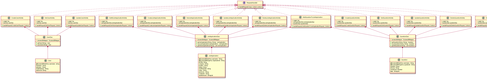

# 6. API

## 6.1. Public Models

```
// UserModel

String username;
String firstname;
String lastname
String emailAddress;
```

```
// JobApplicationModel

String username;
String applicationId;
String jobTitle;
String company;
String location;
String status;
String nextReminder;
String notes;
String jobUrlLink;
StringList questionsList;
```

```
// QuestionModel

String username;
String questionId;
String question;
String answer;
Boolean needsWork;
StringList tags;

```

### 6.2. Get User Endpoint

* Accepts `GET` requests to `/users/:username`
* Accepts a username and returns the corresponding UserModel.
    * If the given user Id is not found, will throw a
      `UserNotFoundException`
    * If password does not match for user, will throw a 
        `InvalidPasswordException`

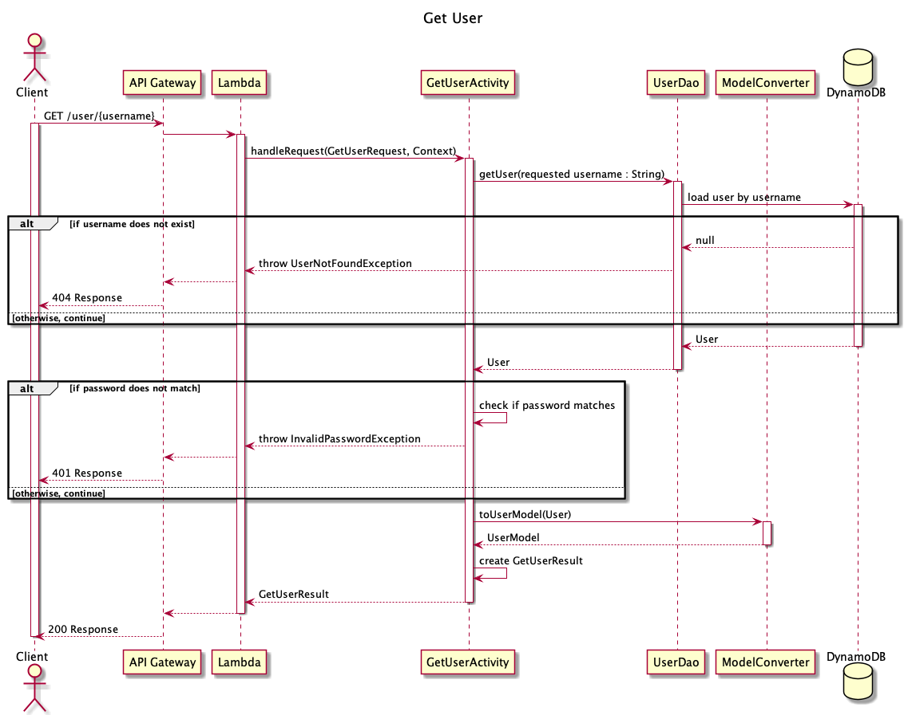


### 6.3. Create User Endpoint

* Accepts `POST` requests to `/users`
* Accepts data to create a new user with a provided firstname, lastname, emailAddress and password.
  Returns the new user, including a unique
  user ID assigned by the Job Tracker Service.
* For security concerns, we will validate the provided user firstname and user lastname does not
  contain any invalid characters: `" ' \`
    * If the name contains any of the invalid characters, will throw an
      `InvalidAttributeValueException`.
* For security concerns, we will validate the provided user email address is valid
    * If the email address is not a valid format, will throw an
      `InvalidAttributeValueException`.
* For security concerns, we will validate the password is at least 6 characters long
    * If the password is invalid, will throw an
      `InvalidAttributeValueException`.

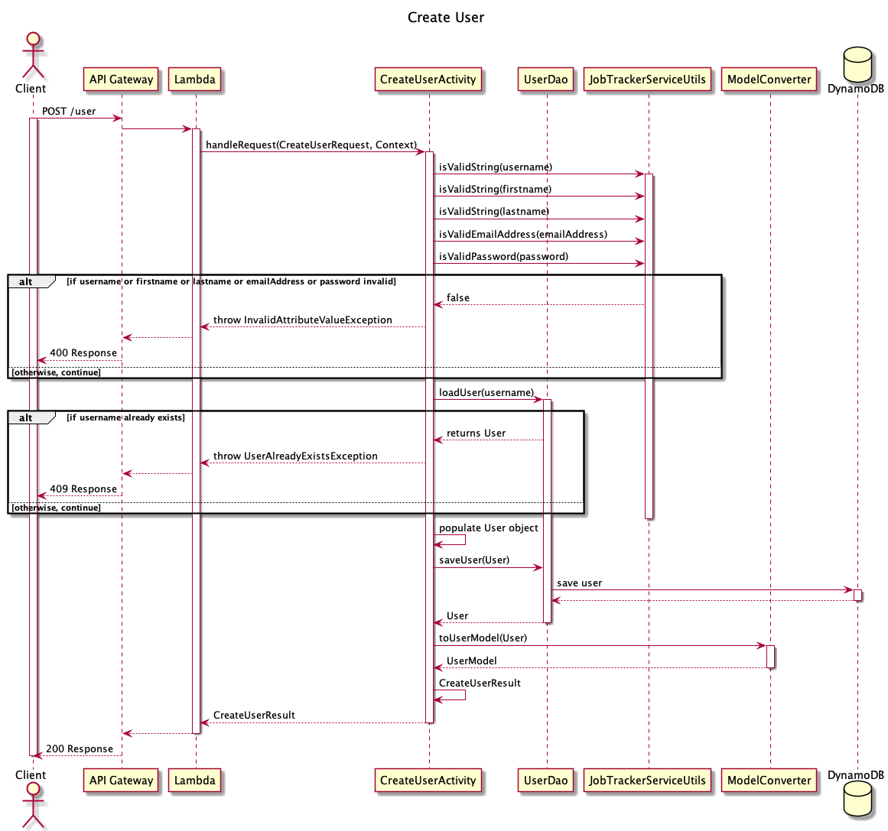

### 6.4. Update User Endpoint

* Accepts `PUT` requests to `/users/:username`
* Accepts data to update a user including a username, an updated firstname or lastname or password.
  Returns the updated user.
    * If the username is not found, will throw a `UserNotFoundException`
* For security concerns, we will validate the provided firstname or lastname does not
  contain invalid characters: `" ' \`
    * If the name contains invalid characters, will throw an
      `InvalidAttributeValueException`
* For security concerns, we will validate the password is atleast 6 characters long
    * If the password is invalid, will throw an
      `InvalidAttributeValueException`.

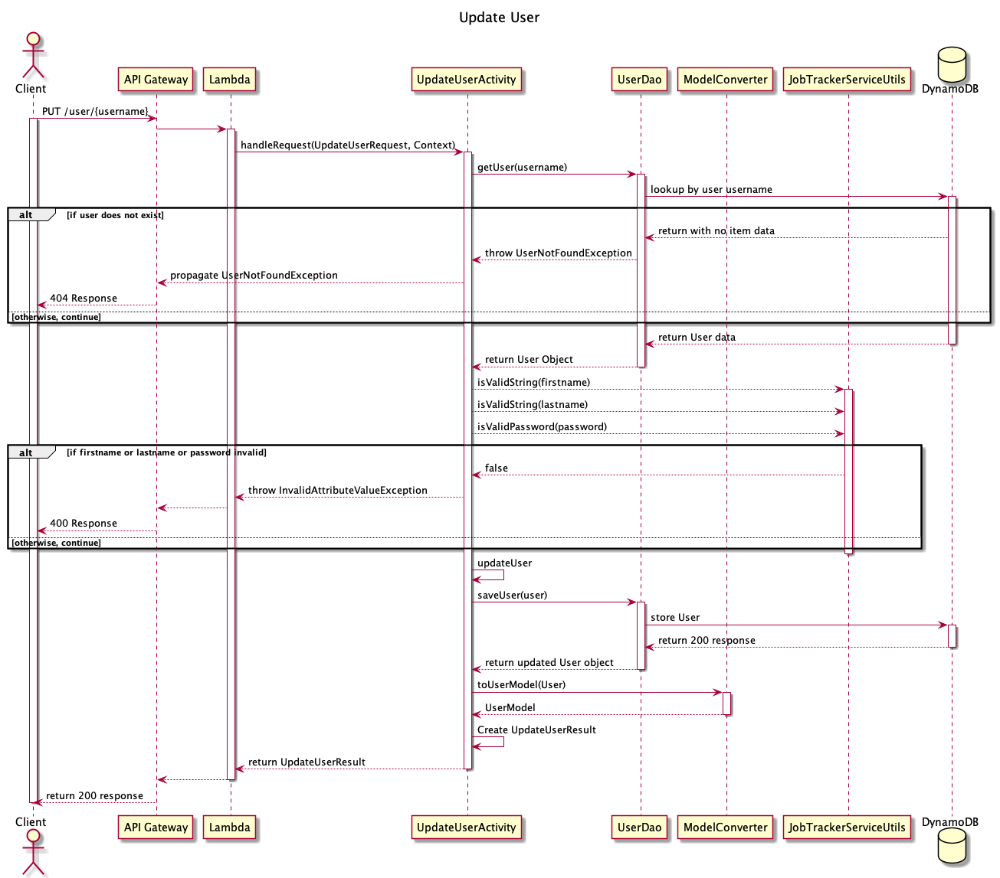

### 6.5. Create Job Application Endpoint

- Accepts `POST` requests to `/user/:username/jobapplication`
- Accepts data to create a new job application with a given userId and name. Assigned a random unique applicationId by the JobSmarter service.
- If name is not a valid string, throws an `InvalidAttributeValueException`

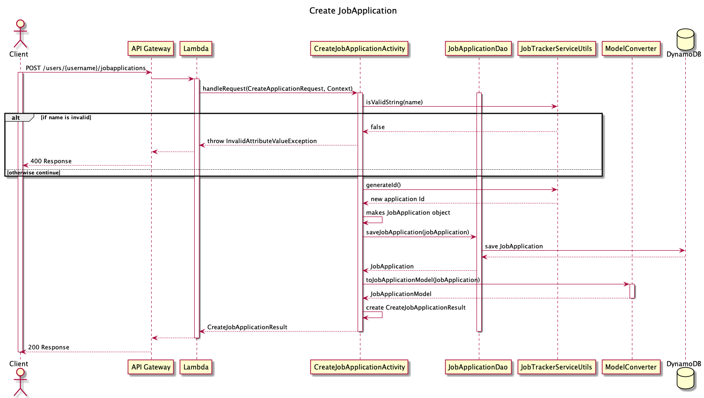

### 6.6. Update Job Application Endpoint

- Accepts `PUT` requests to `/user/:username/jobapplication/:applicationId`
- Accepts a username and applicationId, and optional updated attributes such as status, notes, nextReminder, etc. Returns the updated application.
- If applicationId is not found, throws an `JobApplicationNotFoundException`
- If updated name is not valid, throws an `InvalidAttributeValueException`

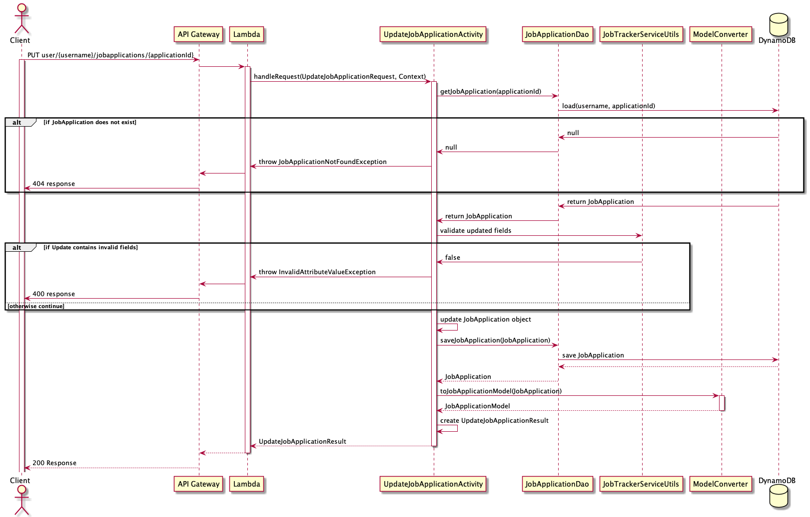

### 6.7 Get Job Application Endpoint

- Accepts `GET` requests to `/user/:username/jobapplication/:applicationId`
- Accepts a username and applicationId. Returns the application.
- If applicationId is not found, throws an `JobApplicationNotFoundException`

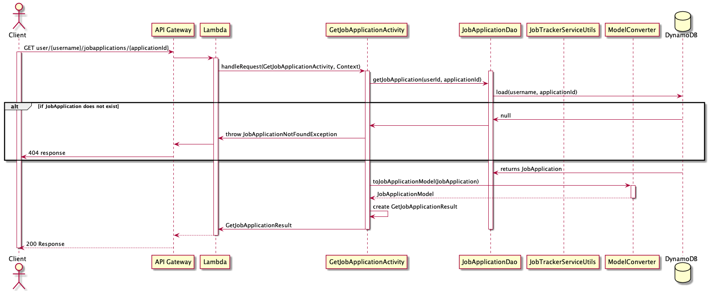

### 6.8 Get All Job Applications

- Accepts `GET` requests to `/user/:username/jobapplication/`
- Accepts a username. Returns list of all applications for that user.
- If user does not have any applications, returns an empty list 

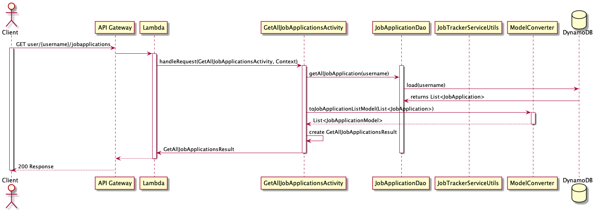

### 6.9 Delete Job Application Endpoint

- Accepts `DELETE` requests to `/user/:username/jobapplication/:applicationId`
- Accepts a username and applicationId. Deletes the JobApplication
- If the specified JobApplication does not exist, throws `JobApplicationNotFoundException`

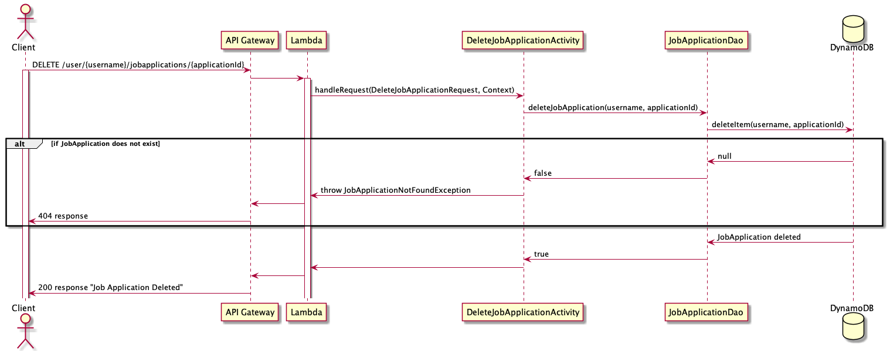

## 6.10 Get Question Endpoint

* Accepts `GET` requests to `/users/:username/questions/:questionId`
* Accepts a question ID and returns the corresponding QuestionModel.
    * If the given question ID is not found, will throw a
      `QuestionNotFoundException`

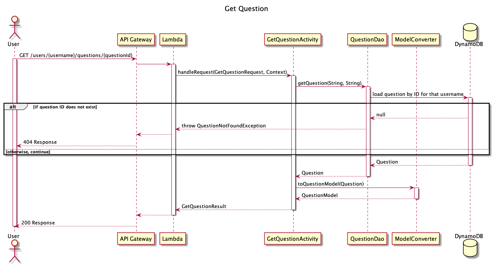
    
## 6.11 Create Question Endpoint

* Accepts `POST` requests to `/users/:username/questions/`
* Accepts data to create a new question with a provided username, a given question, a true or false for needsWork,
* an optional answer and an optional list of tags. Returns the new Question, including a unique
  question ID assigned by the JobTrackerServiceUtils.
* For security concerns, we will validate the provided userId does not
  contain any invalid characters: `" ' \`
    * If the question String contains any of the invalid characters, will throw an
      `InvalidAttributeValueException`.

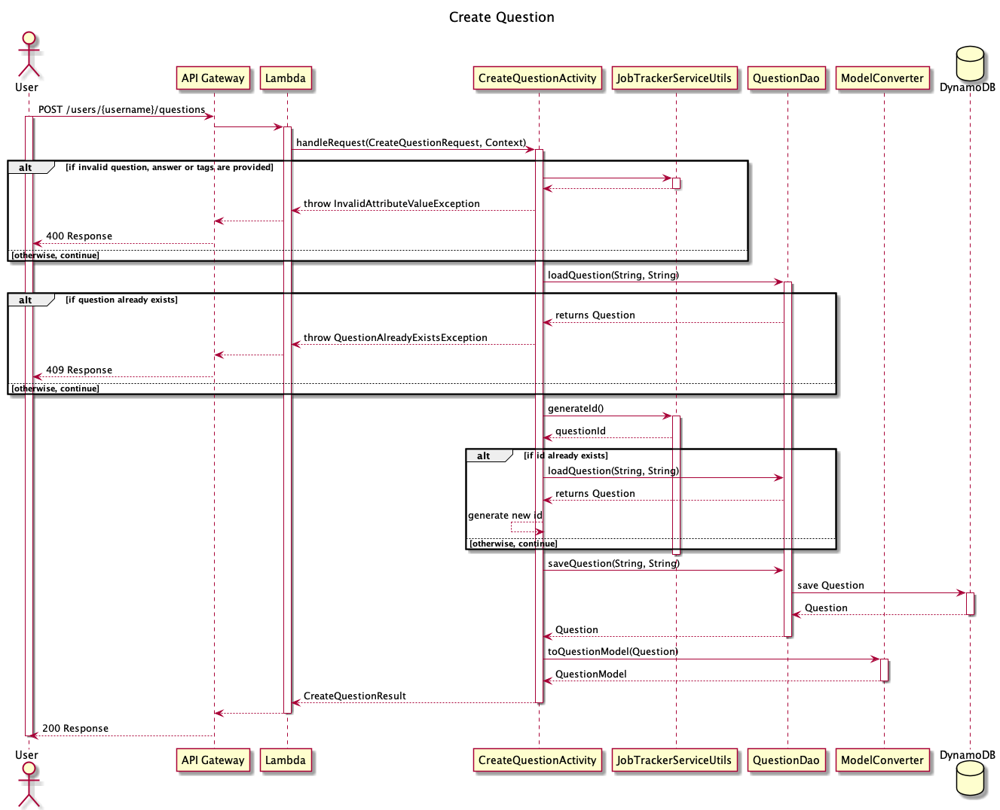

## 6.12 Update Question Endpoint

* Accepts `PUT` requests to `/users/:username/questions/:questionId`
* Accepts data to update a question with a provided username and question ID, including an updated answer, a true or
* false for needsWork, and an optional list of tags for the question. Returns the updated
  question.
    * If the username is not found, will throw a `UserNotFoundException`
    * If the question ID is not found, will throw a `QuestionNotFoundException`
    * If the question tags contains invalid characters, will throw an
      `InvalidAttributeValueException`

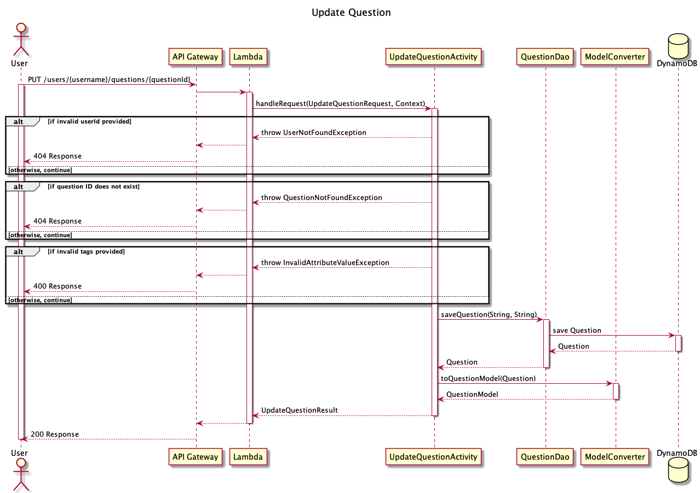

## 6.13 Add Question to Job Application Endpoint

* Accepts `POST` requests to `/users/:username/jobapplications/:applicationId/questions/`
* Accepts a application ID and a question to be added. The question is specified by the
  username and questionId
    * If the provided userId is invalid, will throw a `UserNotFoundException`
    * If the applicationId is not found, will throw a `JobApplicationNotFoundException`
    * If the given questionId does not exist for the userId, will throw an `QuestionNotFoundException`
* By default, will insert the new question to the end of the list of questions

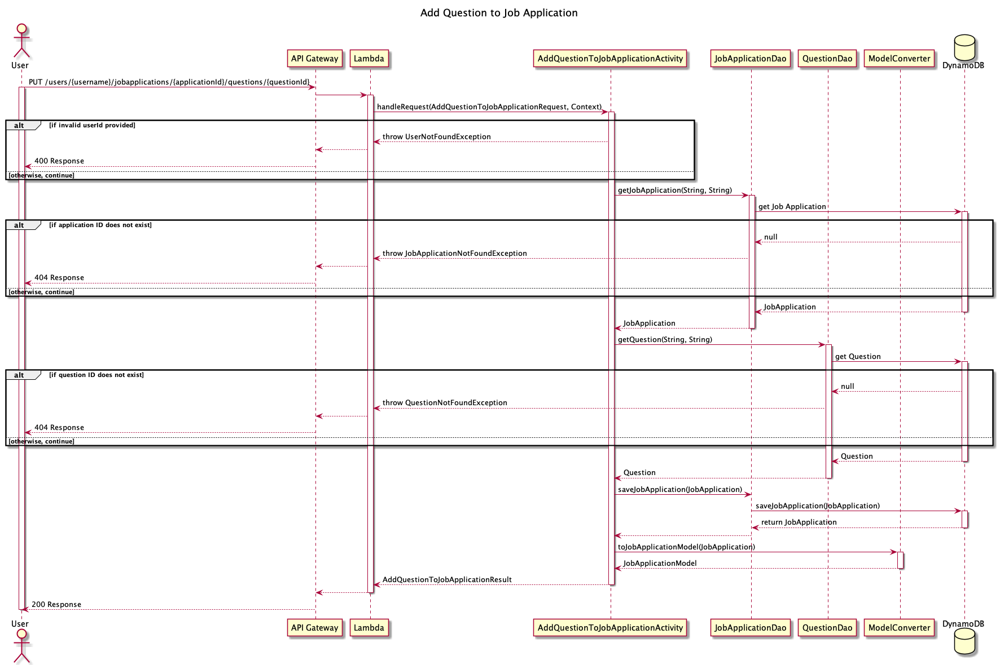

## 6.14. Get All Questions Endpoint

* Accepts `GET` requests to `/username/questions/`
* Retrieves all questions of a user with the given username
* Returns the questions list in default order
    * If the optional `tags` parameter is provided, this API will return the
      list of questions sorted on the value of `tags`
* If the username does not exist, will throw a `UserNotFoundException`
* If the username is found, but contains no questions, will return an empty list

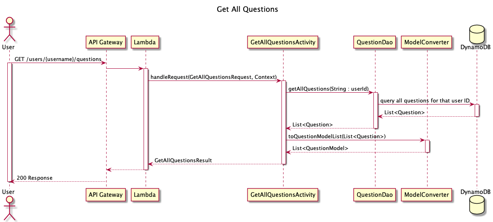

# 7. Tables

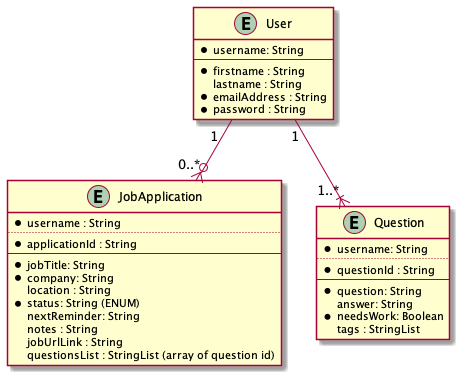

### 7.1. `Users`

```
username // partition key, string
firstname // string
lastname // string
emailAddress // string
password // string
```

### 7.2. `JobApplications`

```
username // partition key, string
applicationId // sort key, string
jobTitle // string
company // string
location // string
status // string
nextReminder // string
notes // string
jobUrlLink // string
questionsList // stringList
```

### 7.3. `Questions`

```
username // partition key, string
questionId // sort key, string
question // string
answer // string
tag // stringList
needsWork // boolean
```

# 8. Pages

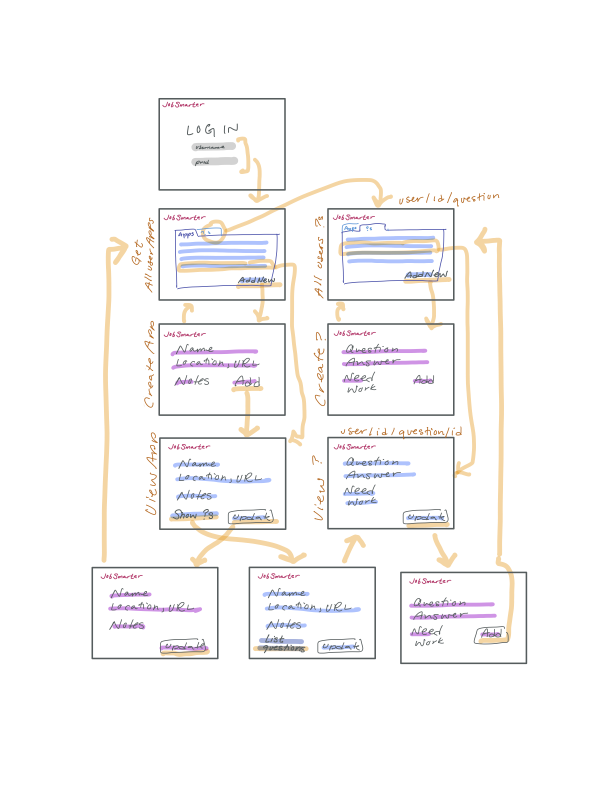
